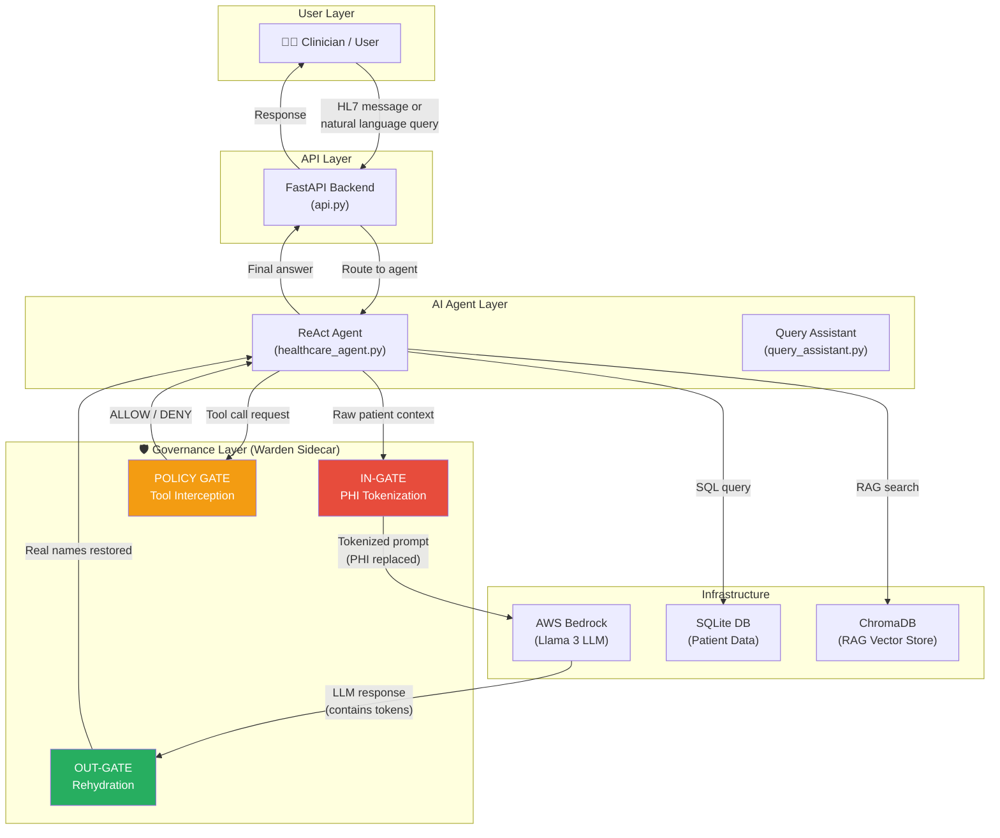
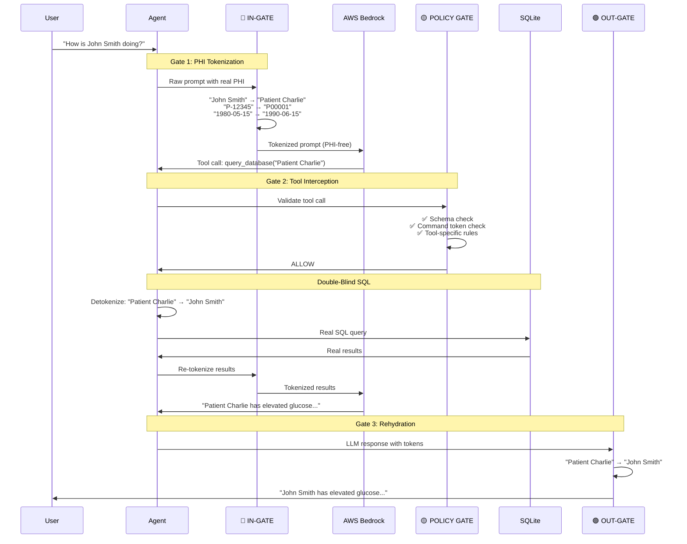

# Health Data Agent — Through the AI Governance Lens

## What This Project Actually Is

**Health Data Agent** is a healthcare AI system that ingests clinical lab data (HL7 v2 messages), converts it to the modern FHIR R4 standard, stores it in a database, and lets users ask natural-language questions about patient data — all while an AI agent (powered by AWS Bedrock / Llama 3) reasons through the answers.

**Live at**: [healthdataagent.com](https://healthdataagent.com)

The governance angle is this: **every interaction between the AI and patient data is mediated by a deterministic security layer called the MCP Warden Sidecar**, which enforces HIPAA, NIST AI RMF, and Colorado AI Act requirements *in code*, not just in policy documents.

---

## The Big Picture — Architecture



---

## Part 1: The Clinical Data Pipeline

Before any AI reasoning happens, the system needs to get patient data in.

### HL7 Ingestion → FHIR Conversion

| Step | File | What Happens |
|:-----|:-----|:-------------|
| 1. Receive | [api.py](file:///c:/Users/bradl/Desktop/healthcare_ai_agent/app/api.py) | `POST /oru/parse` — receives raw HL7 v2 ORU^R01 messages |
| 2. Validate | [hl7_msh.py](file:///c:/Users/bradl/Desktop/healthcare_ai_agent/app/hl7_msh.py) | Parses the MSH header, rejects non-ORU message types |
| 3. Parse | [hl7_parser.py](file:///c:/Users/bradl/Desktop/healthcare_ai_agent/app/hl7_parser.py) | Extracts Patient (PID), Orders (OBR), and Observations (OBX) segments |
| 4. Convert | [fhir_builder.py](file:///c:/Users/bradl/Desktop/healthcare_ai_agent/app/fhir_builder.py) | Generates a FHIR R4 Bundle with Patient + Observation resources |
| 5. Enrich | [agent.py](file:///c:/Users/bradl/Desktop/healthcare_ai_agent/app/agent.py) | If text-based OBX segments exist (TX/FT types), the LLM extracts structured findings from clinical notes |
| 6. Alert | [alerts.py](file:///c:/Users/bradl/Desktop/healthcare_ai_agent/app/alerts.py) | Deterministic rules flag CRITICAL/WARNING values (e.g., glucose > 400 = CRITICAL) |
| 7. Persist | [db.py](file:///c:/Users/bradl/Desktop/healthcare_ai_agent/app/db.py) | Stores in SQLite with full schema: `hl7_messages`, `observations`, `visits`, `medications`, `diagnoses` |
| 8. ACK | [hl7_msh.py](file:///c:/Users/bradl/Desktop/healthcare_ai_agent/app/hl7_msh.py) | Generates HL7 v2 ACK message back to the sender |

> [!NOTE]
> The HL7 → FHIR conversion is **deterministic** — no LLM involved. The AI only activates for clinical note extraction (text OBX segments) and natural-language queries. This is a deliberate governance decision: **structured data transformations should never depend on non-deterministic AI**.

---

## Part 2: The AI Agent (ReAct Architecture)

When a user asks a question like *"Which patients should I be worried about?"*, the system uses a **ReAct (Reason + Act) agent** that:

1. **Plans** — The LLM decides which tools to call
2. **Executes** — Tools run (database query, RAG search, calculator, etc.)
3. **Synthesizes** — The LLM turns raw results into a natural-language answer

### Available Tools

| Tool | Purpose | Example |
|:-----|:--------|:--------|
| `query_database` | NL → SQL against patient DB | "Show patients with high glucose" |
| `search_guidelines` | RAG search over medical docs | "What is normal blood pressure?" |
| `get_patient_context` | Full patient timeline | "Tell me about John Smith" |
| `clinical_calculator` | BMI, eGFR calculations | "Calculate BMI for 80kg, 1.75m" |
| `ask_clarification` | Handle ambiguity | "Is 85 good?" → "What measurement?" |

### Deep Mode (Reasoning Router)

The agent supports two reasoning depths:
- **Standard**: Single-pass ReAct loop (plan → execute → synthesize)
- **Deep**: Adds a *reflection step* where a "Senior Clinical AI Supervisor" persona analyzes complexity and formulates a strategy before the ReAct loop runs

---

## Part 3: The Governance Layer — MCP Warden Sidecar

> [!IMPORTANT]
> **This is the heart of the AI governance story.** The Warden is not a bolted-on afterthought — it's a sidecar proxy that sits between the agent and every external system (LLM, database, tools).

### File: [warden.py](file:///c:/Users/bradl/Desktop/healthcare_ai_agent/app/warden.py) (761 lines)

The Warden implements the **Presidio pattern** (Microsoft's approach to PII handling) as a three-gate MCP sidecar:



---

### Gate 1: IN-GATE (PHI Tokenization)

**Purpose**: Ensure the LLM *never sees real PHI*.

**How it works**:

| PHI Category | Real Value | Token (What LLM Sees) | Method |
|:-------------|:-----------|:-----------------------|:-------|
| Patient Name | "John Smith" | "Patient Charlie" | NATO phonetic pool |
| Patient ID | "P-12345" | "P00001" | Sequential counter |
| Date of Birth | "1980-05-15" | "1990-06-15" | Synthetic DOB pool (preserves approximate age) |
| Provider Name | "Dr. Alice Chen" | "Dr. Morgan" | Synthetic provider pool |

**Key design decisions**:
- **Format-preserving**: Tokens look natural ("Patient Charlie", not "[REDACTED-001]"), so the LLM reasons naturally
- **Session-pinned**: The `PHITokenMap` is created fresh per request, lives in RAM only, and is explicitly zeroed on cleanup
- **Never persisted**: The mapping between real values and tokens is **never** written to disk, logs, or cache

**Code**: See [PHITokenMap](file:///c:/Users/bradl/Desktop/healthcare_ai_agent/app/warden.py#L104-L175) and [WardenAnalyzer](file:///c:/Users/bradl/Desktop/healthcare_ai_agent/app/warden.py#L181-L278)

**Compliance**: 
- HIPAA Safe Harbor §164.514(b) — removes 6 of the 18 identifiers present in the schema
- NIST AI 100-1 §5.2 — Data Minimization (PHI never reaches the LLM)

---

### Gate 2: POLICY GATE (Tool Call Interception)

**Purpose**: Every tool call the LLM makes passes through deterministic validation *before* execution.

Three checks run in sequence (fail-closed):

#### Check 1: Strict Type-Checking
Every tool has a registered schema. If the LLM sends the wrong types, the call is **DENIED**.

```python
TOOL_SCHEMAS = {
    "query_database":      {"query": str},
    "search_guidelines":   {"query": str},
    "get_patient_context":  {"patient_id": (str, None), "patient_name": (str, None)},
    "clinical_calculator":  {"calculation": str, "params": dict},
    "ask_clarification":   {"question": str},
}
```

An unregistered tool → automatic DENY. This prevents the LLM from inventing tools.

#### Check 2: Command-Token Validator (Contextual Jail)
Scans all string parameters for injection patterns:

```python
BLOCKED_COMMAND_TOKENS = [
    "ignore previous", "disregard", "system prompt", "override",
    "drop table", "delete from", "insert into", "update set",
    "exec(", "eval(", "import os", "__import__", "subprocess",
    "you are now", "act as", "new instructions", "forget everything",
    "from now on", "pretend to be",
]
```

This catches **indirect prompt injection** — where an attacker embeds malicious instructions in patient data that the LLM might act on.

#### Check 3: Tool-Specific Policy Rules
Each tool has deterministic business rules:

| Tool | Policy Rules |
|:-----|:-------------|
| `query_database` | Blocks write operations (regex for INSERT, UPDATE, DELETE, DROP, etc.), blocks restricted tables (`contacts`) |
| `search_guidelines` | Enforces 500-char query limit |
| `get_patient_context` | Requires at least one patient identifier |
| `clinical_calculator` | Whitelist: only `bmi` and `egfr` allowed |
| `ask_clarification` | Always allowed (safe by design) |

**Code**: See [WardenPolicy](file:///c:/Users/bradl/Desktop/healthcare_ai_agent/app/warden.py#L348-L548)

**Compliance**:
- OWASP Agentic Top 10 2026 — Tool call security
- Colorado AI Act (CAIA) — Duty of Reasonable Care (deterministic, auditable enforcement)

---

### Gate 3: OUT-GATE (Rehydration)

**Purpose**: Restore real patient names in the final answer so the user sees actual data.

The LLM generates: *"Patient Charlie has elevated glucose at 250 mg/dL"*
The OUT-GATE restores: *"John Smith has elevated glucose at 250 mg/dL"*

**Code**: See [WardenContext.deanonymize](file:///c:/Users/bradl/Desktop/healthcare_ai_agent/app/warden.py#L752-L754)

---

### The Double-Blind SQL Pattern

This is one of the most clever governance patterns in the system:

1. The LLM plans a query using **tokens**: `WHERE name = 'Patient Charlie'`
2. Before hitting the DB, the Warden **detokenizes** the SQL: `WHERE name = 'John Smith'`
3. The DB returns **real results** with real names
4. Before sending results back to the LLM, the Warden **re-tokenizes**: `"John Smith"` → `"Patient Charlie"`

> **The LLM never handles real PHI at any point.** The database never receives tokens. Each side sees only what it needs.

**Code**: See the execution flow in [healthcare_agent.py](file:///c:/Users/bradl/Desktop/healthcare_ai_agent/app/healthcare_agent.py#L416-L490)

---

### PHI-Free Audit Logging

The audit log records *that* tokenization occurred and *which field types* were anonymized, but **never the actual values or the token mappings**.

```json
{
  "ts": "2026-03-06T06:47:12Z",
  "tool": "query_database",
  "decision": "ALLOW",
  "reason": "Query validated — no injection patterns",
  "phi_fields_anonymized": 14,
  "field_types": ["patient_name", "patient_id", "patient_dob", "provider_name"]
}
```

**Compliance**: HIPAA §164.312 — Audit Controls

**Code**: See [WardenAuditLog](file:///c:/Users/bradl/Desktop/healthcare_ai_agent/app/warden.py#L601-L649)

---

### Clinical Surrogation (Production Hook)

The `ClinicalSurrogator` class is a pluggable layer for clinical data masking:

| Level | Behavior | Use Case |
|:------|:---------|:---------|
| **PASS** (demo default) | Medications and diagnoses pass through | Preserves LLM clinical reasoning |
| **CLASS** | RxNorm drug class mapping (Metformin → "Antidiabetic") | Production de-identification |
| **FULL** | SNOMED-CT/ICD-10 chapter rollup + k-anonymity | Full research de-identification |

> [!TIP]
> In demo mode, clinical terms pass through untokenized because hiding "Metformin" would cripple the LLM's ability to reason about diabetes management. The hooks document exactly where production-grade surrogation would plug in.

**Code**: See [ClinicalSurrogator](file:///c:/Users/bradl/Desktop/healthcare_ai_agent/app/warden.py#L555-L594)

---

## Part 4: Defense in Depth — Layered Security

The system doesn't rely on any single defense. Security is layered:

```mermaid
graph LR
    A["User Input"] --> B["Layer 1: API-Level<br/>Injection Detection<br/>(security.py)"]
    B --> C["Layer 2: Input Sanitization<br/>Unicode stripping, emoji removal,<br/>length limits"]
    C --> D["Layer 3: Warden IN-GATE<br/>PHI Tokenization"]
    D --> E["Layer 4: Warden POLICY GATE<br/>Tool Call Validation"]
    E --> F["Layer 5: SQL Validation<br/>SELECT-only, forbidden keywords,<br/>no multi-statement"]
    F --> G["Layer 6: Read-Only DB<br/>SQLite ?mode=ro"]
    G --> H["Layer 7: LLM System Prompt<br/>Anti-jailbreak directives"]
    H --> I["Layer 8: Rate Limiting<br/>5-second cooldown"]

    style B fill:#e74c3c,color:#fff
    style C fill:#e67e22,color:#fff
    style D fill:#f1c40f,color:#000
    style E fill:#2ecc71,color:#fff
    style F fill:#3498db,color:#fff
    style G fill:#9b59b6,color:#fff
    style H fill:#1abc9c,color:#fff
    style I fill:#34495e,color:#fff
```



### Layer-by-Layer Breakdown

| Layer | File | What It Catches |
|:------|:-----|:----------------|
| 1. Injection Detection | [security.py](file:///c:/Users/bradl/Desktop/healthcare_ai_agent/app/security.py) | `[INST]`, `<<SYS>>`, "ignore previous instructions", DAN jailbreak attempts |
| 2. Input Sanitization | [security.py](file:///c:/Users/bradl/Desktop/healthcare_ai_agent/app/security.py) | Zero-width unicode, control characters, emojis, 5000-char limit |
| 3. PHI Tokenization | [warden.py](file:///c:/Users/bradl/Desktop/healthcare_ai_agent/app/warden.py) | Real names, IDs, DOBs never reach the LLM |
| 4. Tool Interception | [warden.py](file:///c:/Users/bradl/Desktop/healthcare_ai_agent/app/warden.py) | Unknown tools, type mismatches, injection in parameters |
| 5. SQL Validation | [query_assistant.py](file:///c:/Users/bradl/Desktop/healthcare_ai_agent/app/query_assistant.py) | Non-SELECT queries, forbidden keywords, multiple statements, SQL comments |
| 6. Read-Only DB | [query_assistant.py](file:///c:/Users/bradl/Desktop/healthcare_ai_agent/app/query_assistant.py#L344) | `sqlite3.connect("file:...?mode=ro")` — write operations fail at DB level |
| 7. LLM Directives | [healthcare_agent.py](file:///c:/Users/bradl/Desktop/healthcare_ai_agent/app/healthcare_agent.py#L150) | Anti-jailbreak instructions baked into system prompts |
| 8. Rate Limiting | [api.py](file:///c:/Users/bradl/Desktop/healthcare_ai_agent/app/api.py#L42-L43) | 5-second cooldown per IP for LLM calls |

---

## Part 5: RAG — Retrieval-Augmented Generation

The system includes a RAG pipeline so the AI can cite **medical guidelines** when interpreting results.

| Component | File | Purpose |
|:----------|:-----|:--------|
| Document Loader | [document_loader.py](file:///c:/Users/bradl/Desktop/healthcare_ai_agent/app/document_loader.py) | Chunks medical guidelines into searchable pieces |
| Embeddings | [embeddings.py](file:///c:/Users/bradl/Desktop/healthcare_ai_agent/app/embeddings.py) | AWS Bedrock Titan embeddings |
| Vector Store | [vector_store.py](file:///c:/Users/bradl/Desktop/healthcare_ai_agent/app/vector_store.py) | ChromaDB with cosine similarity |
| Knowledge Base | [docs/](file:///c:/Users/bradl/Desktop/healthcare_ai_agent/docs) | Blood pressure guidelines, glucose guidelines, lab reference values |

When the agent uses the `search_guidelines` tool, it retrieves relevant chunks from ChromaDB and includes them as context in the LLM prompt. Sources are tracked and displayed to the user with relevance scores.

> [!NOTE]
> **Governance relevance**: RAG provides *source attribution* — the AI cites where its clinical knowledge comes from, making its reasoning auditable and traceable. This aligns with NIST AI RMF requirements for transparency in AI decision-making.

---

## Part 6: Compliance Mapping

### Regulation → Code

| Regulation | Requirement | Mechanism in Code |
|:-----------|:-----------|:-----------------|
| **HIPAA Safe Harbor** §164.514(b) | Remove 18 identifiers | Warden IN-GATE tokenizes 6 identifiers present in schema (names, DOBs, IDs, provider names, emails, IPs) |
| **HIPAA** §164.312 | Audit controls | `WardenAuditLog` — PHI-free JSONL append-only log |
| **NIST AI 100-1** §4.1 | Adversarial robustness | Command-Token Validator blocks 30+ injection patterns |
| **NIST AI 100-1** §5.2 | Data minimization | PHI never reaches the LLM; `PHITokenMap` is ephemeral, RAM-only |
| **Colorado AI Act** (CAIA) | Duty of reasonable care | Deterministic policy engine with documented ALLOW/DENY reasoning |
| **Colorado AI Act** (CAIA) | Impact assessment | Automated adversarial testing ([NAS-1 report](file:///c:/Users/bradl/Desktop/healthcare_ai_agent/NAS-1_COMPLIANCE_REPORT.md)) |
| **OWASP Agentic Top 10** 2026 | Tool poisoning prevention | POLICY GATE intercepts every tool call with schema + blocklist + policy checks |
| **OWASP Agentic Top 10** 2026 | Indirect prompt injection | Blocked command tokens + input sanitization + anti-jailbreak directives |

### NAS-1 Compliance Report Results

The system has been tested with **72 randomized adversarial attack vectors** across 4 categories:

| Test Category | Vectors | Blocked | Rate |
|:-------------|:--------|:--------|:-----|
| Tool Poisoning (Fuzzed) | 19 | 19 | 100% |
| Indirect Prompt Injection (Fuzzed) | 21 | 21 | 100% |
| PHI Leakage (Dynamic DB Scan) | 17 | 17 | 100% |
| Data Minimization (Dynamic Fuzz) | 15 | 15 | 100% |
| **Total** | **72** | **72** | **100%** |

---

## Part 7: File Map — Where Everything Lives

### Core Application (`app/`)

| File | Lines | Role in Governance |
|:-----|:------|:-------------------|
| [warden.py](file:///c:/Users/bradl/Desktop/healthcare_ai_agent/app/warden.py) | 761 | **The governance layer** — IN-GATE, POLICY GATE, OUT-GATE |
| [healthcare_agent.py](file:///c:/Users/bradl/Desktop/healthcare_ai_agent/app/healthcare_agent.py) | 1023 | ReAct agent — orchestrates Warden calls at each step |
| [query_assistant.py](file:///c:/Users/bradl/Desktop/healthcare_ai_agent/app/query_assistant.py) | 663 | NL→SQL with SQL validation and RAG integration |
| [api.py](file:///c:/Users/bradl/Desktop/healthcare_ai_agent/app/api.py) | 984 | FastAPI routes — rate limiting, input validation |
| [security.py](file:///c:/Users/bradl/Desktop/healthcare_ai_agent/app/security.py) | 114 | Injection detection, input sanitization |
| [llm_client.py](file:///c:/Users/bradl/Desktop/healthcare_ai_agent/app/llm_client.py) | 289 | AWS Bedrock client — JSON repair, prompt formatting |
| [agent.py](file:///c:/Users/bradl/Desktop/healthcare_ai_agent/app/agent.py) | 311 | ORU pipeline — HL7 parse → LLM enrich → FHIR build → persist |
| [hl7_parser.py](file:///c:/Users/bradl/Desktop/healthcare_ai_agent/app/hl7_parser.py) | 317 | HL7 v2 message parsing (PID, OBR, OBX segments) |
| [fhir_builder.py](file:///c:/Users/bradl/Desktop/healthcare_ai_agent/app/fhir_builder.py) | ~200 | FHIR R4 Bundle generation |
| [vector_store.py](file:///c:/Users/bradl/Desktop/healthcare_ai_agent/app/vector_store.py) | 117 | ChromaDB RAG vector store |
| [db.py](file:///c:/Users/bradl/Desktop/healthcare_ai_agent/app/db.py) | ~400 | SQLite schema, CRUD, pruning |

### Key Governance Documents

| File | Purpose |
|:-----|:--------|
| [NAS-1_COMPLIANCE_REPORT.md](file:///c:/Users/bradl/Desktop/healthcare_ai_agent/NAS-1_COMPLIANCE_REPORT.md) | NIST Agent Security Assessment — 72 attack vectors, 100% block rate |
| [SECURITY_TEST_RESULTS.md](file:///c:/Users/bradl/Desktop/healthcare_ai_agent/SECURITY_TEST_RESULTS.md) | Security testing documentation |
| [warden_audit.jsonl](file:///c:/Users/bradl/Desktop/healthcare_ai_agent/warden_audit.jsonl) | Live PHI-free audit trail |

---

## Summary: Why This Project Matters for AI Governance

This project demonstrates that **AI governance in healthcare doesn't have to be a separate compliance exercise** — it can be embedded directly into the system architecture:

1. **PHI never reaches the LLM** — The Warden tokenizes everything before it crosses the trust boundary
2. **Every tool call is intercepted** — Deterministic ALLOW/DENY decisions, not probabilistic LLM judgment
3. **Audit trail is PHI-free** — You can share the audit log with regulators without a BAA
4. **Defense in depth** — 8 layers, so no single point of failure
5. **Compliance is testable** — The NAS-1 report runs automated adversarial simulations, not checkbox audits
6. **Production hooks are documented** — Clinical surrogation levels show exactly where to upgrade for production

The Warden sidecar pattern is reusable: it can be applied to any LLM-powered agent that handles sensitive data, not just healthcare.
